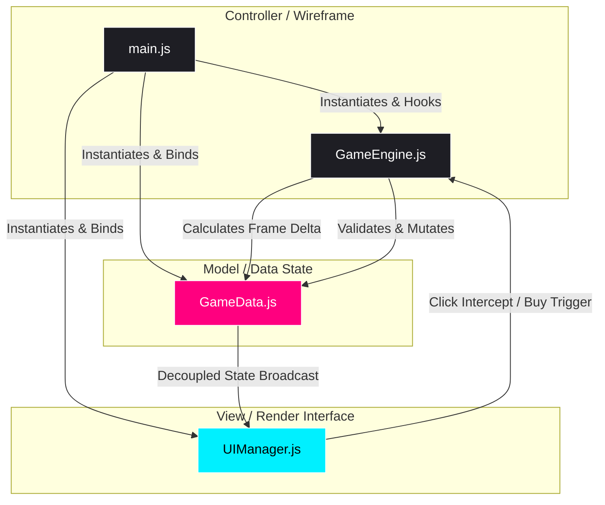

# ⚡ LiveOps Tycoon

<p align="center">
  <a href="https://stonedhawk.github.io/liveops-tycoon">
    
  </a>
  
  
  
  
</p>

---

## 🎮 Try the Live Simulator
👉 **[Click here to play LiveOps Tycoon on GitHub Pages!](https://stonedhawk.github.io/liveops-tycoon)**

---

## 📝 Overview

**LiveOps Tycoon** is an ultra-premium, high-performance resources management idle game simulator designed directly for modern desktop and mobile browsers. Players act as elite Product Managers/LiveOps Directors of a hyper-growth mobile game studio. Your goals are to scale systems, balance monetization models, and command liveops campaigns:

1. **Grow Daily Active Users (DAU)** via App Store Optimization, Influencer partnerships, and massive Viral Marketing campaigns.
2. **Optimize Average Revenue Per DAU (ARPDAU)** by deploying rewarded video ads, battle passes, and deep gacha mechanisms.
3. **Execute Live Events** ("Run LiveOps Event") to orchestrate immediate high-impact revenue boosts.
4. **Scale Passive Revenue Production** powered by precision mathematical costing models and frame-buffered delta-time simulations.

---

## 🏗️ Decoupled MVC Technical Architecture

This application strictly implements a modular, lightweight **Model-View-Controller (MVC)** framework using raw ES6 Javascript and standard CSS custom properties. It features zero heavy external dependencies, yielding instantaneous page load performance and minimal memory footprint.



### 🗂️ Component Organization
* **Model (`js/GameData.js`):** Encapsulates single-source-of-truth variables (`revenue`, `dau`, `arpdau`), manages mathematical costs scaling, and serializes/deserializes states seamlessly via standard JSON storage.
* **View (`js/UIManager.js`):** Manages dynamic HTML injections and updates. Implements a static **DOM Node Caching system** that resolves performance overhead by avoiding element queries (`document.getElementById`) inside the real-time game tick.
* **Controller (`js/GameEngine.js` & `js/main.js`):** Establishes the `requestAnimationFrame` loop, bounds real-time clock delta steps, intercepts interactive UI purchases, and evaluates offline progression timelines.

---

## 📊 High-Fidelity Math & Balanced Scaling

### 1. Cost Function Scaling
Upgrades in the marketplace scale exponentially to ensure continuous game balancing and long-term engagement:

$$\text{Cost} = \text{Base Cost} \times 1.15^{\text{Owned}}$$

### 2. Real-Time Passive Income Generation
Passive cash flow accumulates dynamically on every frame refresh cycle, calculated via:

$$\text{Passive Income} = \text{DAU} \times \text{ARPDAU per day}$$

$$\text{Revenue Step} = \frac{\text{Passive Income}}{86400} \times \Delta t$$

*(where $\Delta t$ is the frame delta capped defensively at $1.0$ second to prevent simulation overflow).*

### 3. Idle Number Notation Formatting
Large revenue amounts are seamlessly shortened using standard international idle notation systems:
* `1,500` ➡️ `1.5K`
* `1,000,000` ➡️ `1M`
* `2,500,000,000` ➡️ `2.5B`

---

## ⚡ High-Performance DOM Caching

Standard idle games query the browser DOM repeatedly, causing layout thrashing and high CPU overhead. **LiveOps Tycoon** resolves this by storing live DOM references upon initialization:

```javascript
// Cached during initialization (initUpgradesUI)
this.cache.upgrades[upg.id] = {
    cost: '',
    owned: '',
    disabled: null,
    elOwned: div.querySelector('.upgrade-owned'),
    elCost: div.querySelector('.upg-cost'),
    elBtn: div.querySelector('.btn-buy')
};

// Executed at 60 FPS in updateDashboard - Pure O(1) attribute and value updates
if (upgradeCache.cost !== currentCost) {
    upgradeCache.elCost.textContent = currentCost;
    upgradeCache.cost = currentCost;
}
```

---

## 💻 Developer Setup & Running Locally

Since this simulator uses purely native browser APIs, setting it up is incredibly lightweight.

### 1. Clone the repository
```bash
git clone https://github.com/stonedhawk/liveops-tycoon.git
cd liveops-tycoon
```

### 2. Launch lightweight server (Recommended)
Running through an HTTP server ensures that browser permissions and storage features operate securely:
```bash
# Using Node.js
npx serve .

# Using Python 3
python3 -m http.server 8000
```
Open your browser and navigate to the local host address displayed in the console (e.g. `http://localhost:8000`).

---

## 🛠️ How to Add Custom Upgrades

Adding new mechanics or upgrades is simple. Modify the static catalog in `js/GameData.js`:

```javascript
static get DEFAULT_UPGRADES() {
    return {
        // Existing upgrades...
        
        custom_upgrade: {
            id: 'custom_upgrade',
            name: 'Cross-Promotion Campaign',
            description: 'Increases DAU by 2000.',
            baseCost: 25000,
            owned: 0,
            baseEffect: 2000,
            effectType: 'dau'
        }
    };
}
```

---

## 📄 License
This project is licensed under the MIT License - see the [LICENSE](LICENSE) file for details.
